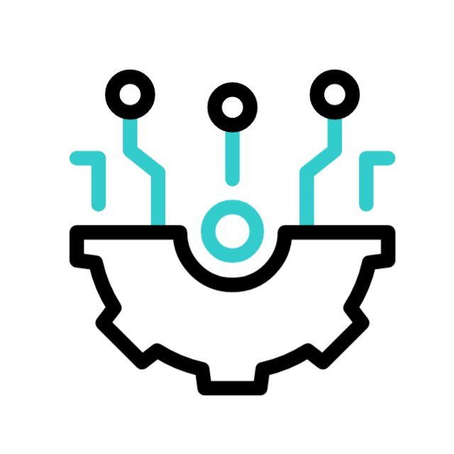

<h2 align="center">Hi , Myself Muhammad IbTaSaM</h2>

  

  <em>
 I'm <b>Muhammad IbTaSaM</b>, a passionate web developer. I hold an M.Sc. in Computer Science from Government College University. My enthusiasm for technology motivates me to embrace challenges and stay ahead in exploring emerging technologies 💻. I’m passionate about contributing to open-source projects 🌍 and find joy in mentoring 🎓 and crafting meaningful solutions 💡.
    
  <b><i>"---Its a difference of just one try between Success and Failure---"</i></b>

    

---

<h1 align="left">  About </h1>

- Solved 100+ Data Structures & Algorithms problems on **[Leetcode](https://leetcode.com/u/ibtasam116/)**.
- Actively participating in international events and hackathons.
- Typing speed 80 WPM.
- Aspiring Full Stack developer(currently knows only frontend development).

<h1 align="left">  Tech Stack</h1>

> Technologies, Tools and Libraries that I utilize for developing and optimizing projects.

<table>
  <tr>
    <td align="center" width="96">
      
       HTML
    </td>
    <td align="center" width="96">
      
       CSS
    </td>
    <td align="center" width="96">
      
       Bootstrap
    </td>
    <td align="center" width="96">
      
       Tailwind
    </td>
    <td align="center" width="96">
      
       MaterialUI
    </td>
    <td align="center" width="96">
      
       SASS
    </td>
    <td align="center" width="96">
      
       JavaScript
    </td>
    <td align="center" width="96">
      
       TypeScript
    </td>
    <td align="center" width="96">
      
       ReactJS
    </td>
    <td align="center" width="96">
      
       NextJS
    </td>
  </tr>
  <tr>
    <td align="center" width="96">
      
       Firebase
    </td>
   <td align="center" width="96">
      
       NodeJS
    </td>
    <td align="center" width="96">
      
       ExpressJS
    </td>
    <td align="center" width="96">
      
       Git
    </td>
    <td align="center" width="96">
      
       GitHub
    </td>
     <td align="center" width="96">
      
       MongoDB
    </td>
    <td align="center" width="96">
      
       MySQL
    </td>
    <td align="center" width="96">
      
       Vercel
    </td>
    <td align="center" width="96">
      
       C
    </td>
    <td align="center" width="96">
      
       C ++
    </td>
    </td>
  </tr>
  <tr>
  <td align="center" width="96">
      
       Figma
    </td>
   <td align="center" width="96">
      
       VSCode
    </td>
    <td align="center" width="96">
      
       Netlify
    </td> 
    <td align="center" width="96">
      
       Postman
    </td>
    <td align="center" width="96">
      
       PostGres
    </td>
    <td align="center" width="96">
      
       Redux
    </td>
    <td align="center" width="96">
      
       Discord
    </td>
    <td align="center" width="96">
      
       GraphQL
    </td>
    <td align="center" width="96">
      
       NPM
    </td>
    <td align="center" width="96">
      
       Sublime
    </td>
  </tr>
  <tr>
    <td align="center" width="96">
      
       Gemini
    </td>
    <td align="center" width="96">
      
       ReadMe
    </td>
  <td align="center" width="96">
      
       Surge
    <td align="center" width="96">
      
       Slack
    </td>
    <td align="center" width="96">
      
       PS
    </td>
    <td align="center" width="96">
      
       xd
    </td>
    <td align="center" width="96">
      
       MS VB
    </td>
      <td align="center" width="96">
      
       Trello
    </td>
    </td>
      <td align="center" width="96">
      
       Reddit
    </td> 
    <td align="center" width="96">
      
       Canva
    </td>
  </tr>
</table>

<h1 align="left">  GitHub Analytics</h1>

> Key insights and metrics to evaluate repository performance.

  
   

---

---
